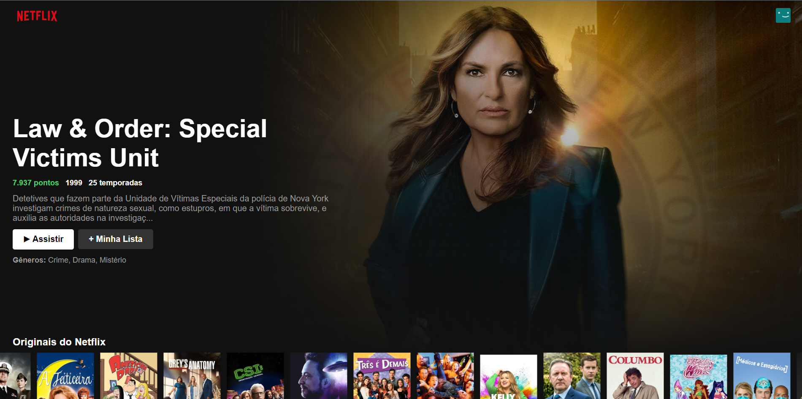
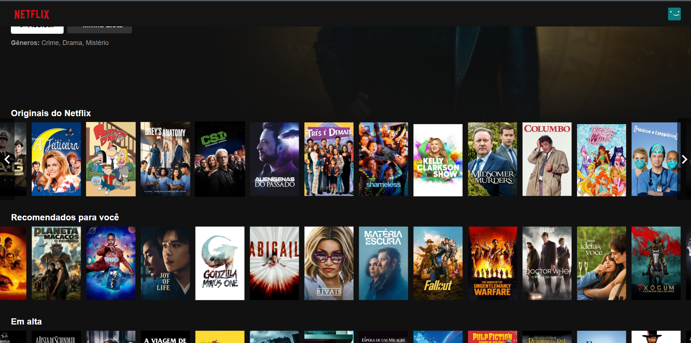

# Netflix Clone em React

Este projeto é um clone da interface de usuário da Netflix, desenvolvido usando React. O objetivo deste projeto é demonstrar habilidades em React, incluindo o uso de componentes funcionais, hooks e estado. Este clone utiliza a API The Movie Database (TMDb) para buscar informações de filmes e séries.





## Tecnologias Utilizadas

- **React**: Biblioteca JavaScript para construir a interface de usuário.
- **CSS**: Para estilização.
- **The Movie Database (TMDb) API**: Para buscar dados dinâmicos de filmes e séries.

## Instalação e Execução

1. Clone o repositório:
    ```bash
    git clone https://seu-repositorio/netflix-clone.git

2. Instale as dependências:
    ```bash
    cd netflix-clone
    npm install

3. Execute o projeto:
    ```bash
    npm start


## Acessar o projeto online

O projeto está rodando no servidor do Vercel. Você pode acessá-lo no link: 

[Clone Netflix](https://netflix-clone-react-alpha-liard.vercel.app/)


### Pré requisitos

* Node
* NPM